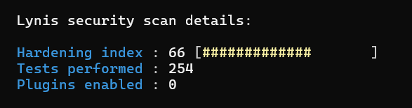

# Linux Hardening Project (CentOS 9)

## Overview
This project demonstrates the hardening of a CentOS 9 virtual machine following security best practices. It includes real-world sysadmin tasks such as service minimization, SSH configuration, PAM tuning, GRUB protection, malware scanning, and integrity checks using AIDE. It was designed for a single-user environment with a non-production use case.

## Goals
- Raise the Lynis hardening index from 66 to 80
- Apply multiple layers of security across authentication, services, permissions, and boot process
- Build a reusable and presentable Linux project for GitHub
- Include real command outputs, before/after audits, and screenshots for evidence

## System Info
- **OS**: CentOS 9 Stream
- **User**: haland (non-root)
- **Audit Tool**: Lynis 3.1.4

## Key Security Enhancements

### 🔐 SSH Configuration Hardening
- Changed SSH port
- Set `PermitRootLogin no`
- Set `MaxSessions 2`
- Disabled `X11Forwarding` and `AllowAgentForwarding`
- Configured `LogLevel VERBOSE`, `MaxAuthTries`, and `AllowTcpForwarding`
- **Files:** `sshd_config_before.txt`, `sshd_config_after.txt`, `sshd_config_final.txt`
  

### 🔒 PAM and Password Policy
- Enforced strong password complexity in `/etc/security/pwquality.conf`
- Tuned `/etc/pam.d/system-auth` to add retry options and password aging
- Locked down root access only after user `haland` was verified to have sudo rights

### 🛡 GRUB Bootloader Protection
- Added hashed password using `grub2-mkpasswd-pbkdf2`
- Modified `/etc/grub.d/40_custom`
- Rebuilt GRUB config
- Tested GRUB password prompt and verified password protection

  
  

### 🧱 Service and Package Minimization
- Removed unused packages: `telnet`, `ftp`, `rsh`, etc.
- Stopped and disabled services like Avahi and Colord
- Captured services before/after

### 🧾 Login Banners
- Added banners to `/etc/issue` and `/etc/issue.net`
- Even though Lynis still flags them, manual verification confirmed presence

### 🕵️ Malware Scanner & Integrity Checks
- Installed `rkhunter`, performed full scan, and configured cron job for daily runs
- Installed and configured `aide`, built baseline database, and saved result
- **Files:** `rkhunter_scan.txt`, `aide_initial_check.txt`

### 🔍 File Permissions and Audits
- Set sticky bit on `/tmp` and `/var/tmp`
- Audited and saved SUID/SGID results
- Removed or locked down unnecessary user accounts
- Verified only one sudoer account exists
- **Files:** `suid_sgid_audit.txt`, `users_before.txt`, `users_after.txt`

### 🚫 Disabled Kernel Protocols
- Blacklisted unused protocols: `dccp`, `sctp`, `rds`, `tipc`
- Configured `/etc/modprobe.d/disable_protocols.conf`

### 🔧 Miscellaneous Improvements
- Updated `/etc/login.defs` with password aging rules
- Set `fs.suid_dumpable = 0` in `/etc/sysctl.conf`
- Verified hostname was correctly set
- Hardened compilers by ensuring `gcc` was not installed
- Disabled USB storage modules using `/etc/modprobe.d/` to prevent removable device use
- Updated firewall rules to match SSH port change and enhance security

## Final Lynis Hardening Result
B
  

- All key suggestions addressed or intentionally excluded due to scope
**Score:** 66 ➝ 80 ✅

## Known Limitations
Some Lynis suggestions were skipped or flagged incorrectly:
- **Separate partitions** for `/home`, `/tmp`, `/var` were skipped as this is a single-VM lab
- **External log host** not used due to scope
- **Login banner** shows in config, but Lynis still flags it — screenshot proves presence
- Auditd rule set could not be verified properly due to service limitations in CentOS Stream

## 🧯 Root Lockout Recovery
During hardening, a configuration error in PAM temporarily prevented login and sudo access. Recovery involved:
- Booting into single-user mode
- Manually editing `/etc/shadow` and `/etc/sudoers`
- Creating a temporary `rescueuser` with root access  
Once `haland` was restored and reverified with sudo privileges, the temporary user was safely removed.

This experience demonstrates real-world troubleshooting and recovery skills in a locked-out Linux environment.

## Conclusion
- All key suggestions addressed or intentionally excluded due to scopeThis project shows realistic Linux system hardening under practical constraints. The system achieved a secure configuration, reflected in the improved Lynis score and supported with clear documentation and screenshots. The final state demonstrates a responsible balance between strict hardening and usability on a non-production system.
